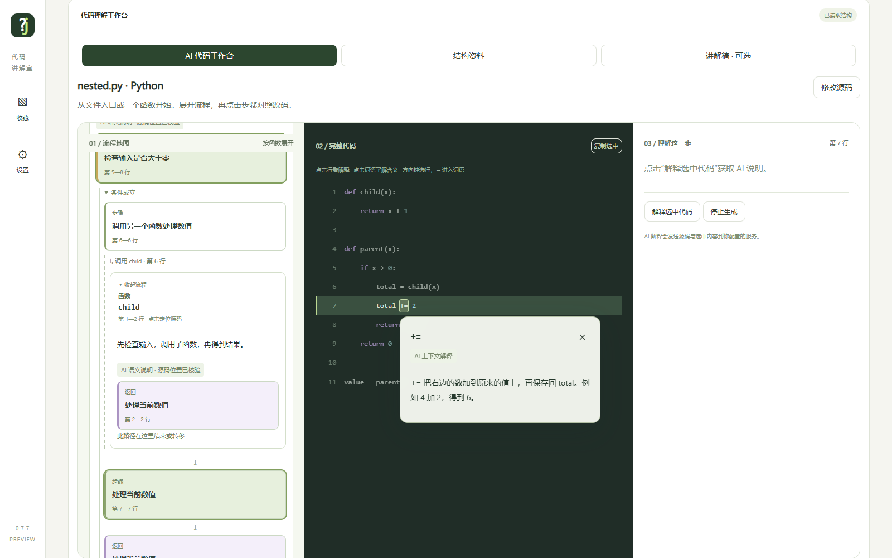

# Who Is JSON

画面上部の **解释风格** で、**零基础友好**（初心者向け・既定）と **标准**（標準）を切り替えられます。選択はブラウザーに保存されます。初心者向けでは、その行で行う処理を短い1〜2文で説明し、必要なときだけ小さな例を添えます。ローカル資料の詳細は展開して読めます。切り替えると現在の AI 説明と説明原稿がクリアされますが、ソースと保存済みカードは変更されません。再生成はユーザーが操作したときだけ行います。説明スタイルの指定は正確性を保証するものではありません。

[简体中文](README.md) · [English](README.en.md) · [日本語](README.ja.md) · [한국어](README.ko.md)

**見つけたコードを理解し、そこから学ぶ。**

Who Is JSON は、**vibe coders（AI を使ってコードを書く人）向けの AI コード読解ツール**です。ソースコードを取り込み、目的や処理の手順、値の変化を確認できます。わからない語をクリックして説明を読み、復習や面接準備に使える独立した解説文を生成できます。ローカル解析に対応する言語では、関数・分岐・ループを元のコードと照合しながらたどれます。

**この日本語版はドキュメントの翻訳です。** 現在のアプリ画面、組み込み知識カード、AI の既定の説明は主に中国語です。画面の言語切り替えは未実装です。操作手順には画面上の中国語ラベルを併記しています。リンク先の補足資料も中国語の場合があります。

現在は **1.0.0 正式版（ソースコード配布）**です。[リリースノート](docs/releases/v1.0.0.md)をご覧ください。取り込んだコードを実行するツールではありません。解析の成功は、プログラムが正しく動くことを保証しません。

このリポジトリは v0.8.0 の公開配布版です。元のフィードバック由来のテスト断片は独自作成のサンプルに置き換え、開発履歴は元の非公開リポジトリに残しています。[公開移行の説明](docs/PUBLIC_MIGRATION.md)と[貢献者](CONTRIBUTORS.md)も参照してください。

## 主な機能

| 機能 | できること | AI は必要？ |
| --- | --- | --- |
| 取り込みとローカル解析 | 貼り付け、ドラッグ、ファイル選択で取り込み、対応言語・関数・ソース範囲を特定 | 不要 |
| AI コードワークスペース | 左に処理フロー、中央に全文、右に選択した処理の説明を表示。ノードから分岐・ループ・例外処理のソースへ移動 | 説明には必要。未設定でもソースと関数一覧を表示 |
| 同一ファイル内の呼び出し展開 | 確認済みの呼び出し先を展開。再帰は無限に展開しない | 必要。位置は解析器で確定し、特に Python に対応 |
| クリックによる説明 | 文や変数、関数名、キーワード、演算子を選び、文脈に沿った説明と小さな例を表示 | 必要 |
| 構造資料と知識カード | ローカル構造、既存の構文教材、例を閲覧・保存・エクスポート | ローカル資料は不要。言語により内容の充実度が異なる |
| 分類付きお気に入り | 必要な内容を備えた AI 知識カードと関連ソースを保存し、分類・検索・分類変更・エクスポート | AI カードの生成には必要。保存済みカードの閲覧は不要 |
| 独立した解説文 | 読者の知識レベル・範囲・詳しさを指定して生成。停止、再試行、エクスポート、集中閲覧 | 必要 |
| 画像認識 | PNG・JPG・WebP を文字に変換し、確認後に解析。英語と簡体字中国語の OCR データを同梱 | ローカル OCR は不要。AI 認識には画像対応モデルが必要 |
| Windows 補助機能 | 範囲指定スクリーンショットとデスクトップのフローティングウィンドウ。依存関係の導入後にルートの起動スクリプトを使用 | 不要 |



*画像は模擬 AI を使った操作検証時のものです。実際の生成文は設定したモデルに依存します。*

## 対応言語：AI の説明と構造表示は別です

**C と C++ も取り込んで AI に説明を依頼できます。** 語句や行の説明、追加質問、独立した解説文はソースを直接使うため、関数一覧がなくても利用できます。品質はモデルと与えられた文脈に依存します。

**説明文は AI が生成し、関数一覧・フローの骨組み・確認済み呼び出し位置はローカル解析器が提供します。** AI は既存ノードに意味を補足します。解析器がない言語の完全な関数グラフを自動生成するものではありません。

| ソースの種類 | AI による説明・質問・解説文 | ローカル構造表示 |
| --- | --- | --- |
| Python | 利用可能 | 関数・分岐・ループ、一部の同一ファイル内呼び出し |
| JavaScript / TypeScript、Java、Bash | 利用可能 | 対応する構造。複雑な構文や呼び出し関係には制限あり |
| Dockerfile、JSON、YAML、HTML、CSS、SQL、`.gitignore` | 利用可能 | 命令・階層・ルール・文など。すべてが処理フロー図になるわけではない |
| **C / C++**（`.c`、`.cpp`、`.h`） | **取り込み後に AI の説明を依頼可能** | ファイル種別の識別のみ。関数一覧・関数フロー・呼び出し展開なし |
| Go、Rust、C#、PHP、Ruby | 対応拡張子から取り込み、AI に説明を依頼可能 | ファイル種別の識別のみ |
| MATLAB などのテキストソース | 貼り付けまたは `.txt` で取り込み、必要なら質問で言語を指定 | 対応する信頼性のあるローカル解析器なし。元の拡張子をすべて直接取り込めるわけではない |

利用可能とは依頼する入口があるという意味で、全言語・全構文・全モデルの正確性を検証済みという意味ではありません。C/C++ のコンパイルや実行、ヘッダーの実装・外部ライブラリ・プロジェクト全体の自動読み込みは行いません。

## インストール

### 必要な環境

- Node.js：最低 **20**、CI に合わせて **24** を推奨。`node` と同梱の `npm` を使用できる状態にしてください。
- Python：開発検証に合わせて **3.12** を推奨。Windows 開発スクリプトは 3.12 以降が必要です。
- pnpm：`package.json` の `packageManager` に従い **10.15.1** に固定。
- 公開リポジトリを clone するか、GitHub から ZIP をダウンロードして展開します。

```sh
git clone https://github.com/Laurent150/Who-Is-JSON-Public.git
cd Who-Is-JSON-Public
```

### Windows（PowerShell 7）

リポジトリのルートで実行します。

```powershell
./dev.ps1 -Task Install
./dev.ps1 -Task Start -Python (Get-Command python.exe).Source
```

`Install` は指定バージョンの pnpm と、ロックファイルに従った依存関係を導入します。`python.exe` が Python 3.12 でない場合、`-Python` の値を Python 3.12 の実行ファイルのパスに変更してください。詳細は[開発への参加](CONTRIBUTING.md)を参照してください。

### pnpm 導入済みの場合（Windows / macOS / Linux）

`pnpm --version` が `10.15.1` であることを確認し、実行します。

```sh
pnpm install --frozen-lockfile --ignore-scripts
pnpm start
```

Python が既定の場所で見つからない場合は、起動前に `CODELINGO_PYTHON` を設定します。macOS / Linux：`export CODELINGO_PYTHON="$(command -v python3)"`。PowerShell：`$env:CODELINGO_PYTHON = (Get-Command python.exe).Source`。

ブラウザーで **http://127.0.0.1:43127** を開きます。停止はターミナルで `Ctrl+C`。ポートは `CODELINGO_PORT` で変更できます。アプリはローカルホストでのみ待ち受けます。スクリーンショット機能とフローティングウィンドウは Windows 専用です。このリリースはソース配布で、依存関係を導入して起動します。デスクトップインストーラーは再ビルドしていません。

## 使い方

1. **コードを入れる。** 「导入文件」（ファイルを取り込む）、貼り付け、または「开源代码试读」（公開コードのサンプル）を使います。ソースは最大 100 KB。元のファイル名は言語判定に役立ちます。画像は「识别代码」（コード認識）の後、字下げ・アンダースコア・句読点を原画像と照合してください。
2. **ワークスペースを開く。** 「查看整段结构」（全体構造を見る）から「AI 代码工作台」に入ります。対応言語は関数・構造一覧を表示し、C/C++ などもソースは表示できます。「未対応」はローカル構造解析の意味で、AI の説明が使えないという意味ではありません。
3. **必要に応じて AI を設定する。** 「设置」（設定）で Chat Completions 互換サービスのベース URL、モデル、キーを入力します。通常のベース URL は `/v1` までで、完全な `/chat/completions` URL ではありません。保存だけでは接続確認は行われません。
4. **コードやフローを読む。** 行をクリックして説明を依頼し、`Shift` で範囲を広げます。語句の説明は `Escape` で閉じます。上下キーで行を選び、右キーで語句へ移動できます。関数を展開して「生成这个函数的 AI 流程」（この関数の AI フローを生成）を選び、各ステップからソースを確認します。関数一覧がない場合はソースの説明や解説文を使います。
5. **復習や面接準備に解説文を生成する。** 「讲解稿 · 可选」（任意の解説文）で知識レベル・範囲・詳しさを指定し、「生成 AI 讲解稿」を選びます。目的、入出力、考え方、主要ステップ、例、制約と Q&A をまとめます。形式的な挨拶や発表時間の設定はありません。AI 概要や関数一覧を先に生成する必要もありません。

「AI 总览（可选）」（任意の AI 概要）は、解析時の概要補足と画像のローカル OCR / AI 認識を切り替えます。**フロー生成、クリックによる説明、解説文生成は独立した AI 操作で、このスイッチをオフにしても一括無効にはなりません。** 各操作には有効なサービス設定が必要です。

AI 設定済みの場合、解析時に言語が不明、解析が失敗、または利用可能な構造が見つからないと、AI が言語判定を補助し、対応するローカル解析器で検証します。概要をオフにしていても動作し、停止できます。判定が不確か、通信失敗、検証失敗の場合は元の結果を保持します。この段階でソースを書き換えたり、構造を創作したりしません。

コピーしたコードの書式に問題がある場合、必要に応じて修復入口を表示します。ローカル整形または AI 提案をプレビューし、差分を確認して適用します。さらに編集する前なら取り消せます。AI 修復は設定したサービスを使い、自動でソースを置き換えません。

### お気に入りと復習

単なる名前の意味は説明だけを表示します。原理、独立した例、注意点を含む知識カードが返った場合のみ保存ボタンを表示します。読み込み中・接続案内・エラーは保存対象になりません。AI による内容分類は誤る可能性があり、例は未実行の仮定に基づく説明です。

「我的收藏」（お気に入り）は全件表示が既定です。「構文と基礎」「フローと関数」「データ構造とアルゴリズム」「非同期とエラー処理」「ファイル・ネットワーク・システム」「開発手法と設計」で絞り込めます。タイトル・タグ・関連ソースも検索できます。保存済みの項目がある分類のみ表示し、分類は手動変更できます。既存のお気に入りは保持して自動分類し、同一カードに複数のソースを関連付けられます。エクスポートには分類と AI 生成の表示を含みます。

保存先は現在のブラウザーのみです。ログイン、クラウド同期、運営側が料金を負担する共通 AI サービスはありません。AI は利用者自身が設定します。

### C/C++ を読む最短手順

`.c` / `.cpp` を取り込む → 全体構造を表示 → AI を設定 → 行や語句をクリック、または解説文を生成。この版では左側に C/C++ の関数フローは生成されません。ヘッダー、マクロ、外部関数の定義が不足する場合、具体的な動作の説明には追加のソースが必要です。

## 入出力の例

`total.py` として保存して取り込みます。

```python
def total_price(prices):
    total = 0
    for price in prices:
        total += price
    return total

amount = total_price([10, 20])
```

- **構造：** 関数は 1〜5 行目、ループは 3〜4 行目、7 行目はその関数の呼び出しです。
- **目的：** 受け取った価格を足し合わせ、合計を返します。
- **手順：** 合計を 0 にする → 各価格を加える → 合計を返す。
- **語句：** `[10, 20]` は数値 2 個のリスト。`+=` は加算して `total` を更新します。`for` の末尾の `:` は、字下げした後続コードがループ本体であることを示します。
- **仮定に基づく結果：** `0 + 10`、次に `10 + 20` で `amount` は 30。`print` がないため 30 は表示されません。

これは意味を確認するための説明例で、モデルの固定出力ではありません。アプリは入力を実行して結果を求めません。AI の説明はソースと照合してください。

## データと制限

- ローカル解析とローカル OCR はモデルへ送信しません。AI 概要、言語判定、修復、フロー、クリック説明、解説文では関連ソースや選択内容を設定先に送信し、AI 画像認識では画像を送信します。料金とサーバー側のデータ処理はサービスに依存します。
- サービス URL、モデル名、お気に入りはブラウザーに保存します。API キーは永続保存せず、再読み込み後は再入力が必要です。お気に入りにソースが含まれるため、共有前に確認してください。
- OCR は誤認識することがあります。字下げは画像上の位置から推定し、解析できても原画像と一致する保証はありません。
- フローはローカルで識別できた構造に依存します。外部関数の内部動作は現在のファイルだけでは確定できません。大きすぎる関数は範囲の縮小を求め、未完成の AI ノード説明はその旨を表示します。
- 自動テストの成功は任意のコードの説明精度や、すべての初心者の理解を保証しません。実モデルの品質は継続評価が必要です。[操作ガイド](docs/STUDIO.md)と[検証記録](VALIDATION.md)を参照してください。

## 開発と資料

```sh
pnpm test
pnpm run test:release
```

Python 3.12 を用意し、`CODELINGO_PYTHON` と、そのディレクトリを含む `PATH` を設定します。Windows は `./dev.ps1 -Task Verify -Python (Get-Command python.exe).Source` で両方実行できます。ブラウザー検証や実 AI 検証は[検証記録](VALIDATION.md)を参照してください。既定のテストは有料モデルを呼び出しません。

- [貢献方法と PR](CONTRIBUTING.md)
- [アーキテクチャ](ARCHITECTURE.md)
- [ワークスペース操作](docs/STUDIO.md)
- [第三者のコード・資料](OPEN_SOURCE_REFERENCES.md)
- [ローカル OCR のデータと制限](ocr-data/README.md)
- [デスクトップパッケージ](desktop/README.md)

プロジェクトのコードは [MIT ライセンス](LICENSE)です。第三者のサンプルや OCR データはそれぞれの出典・ライセンスを保持し、すべてを MIT に変更するものではありません。
