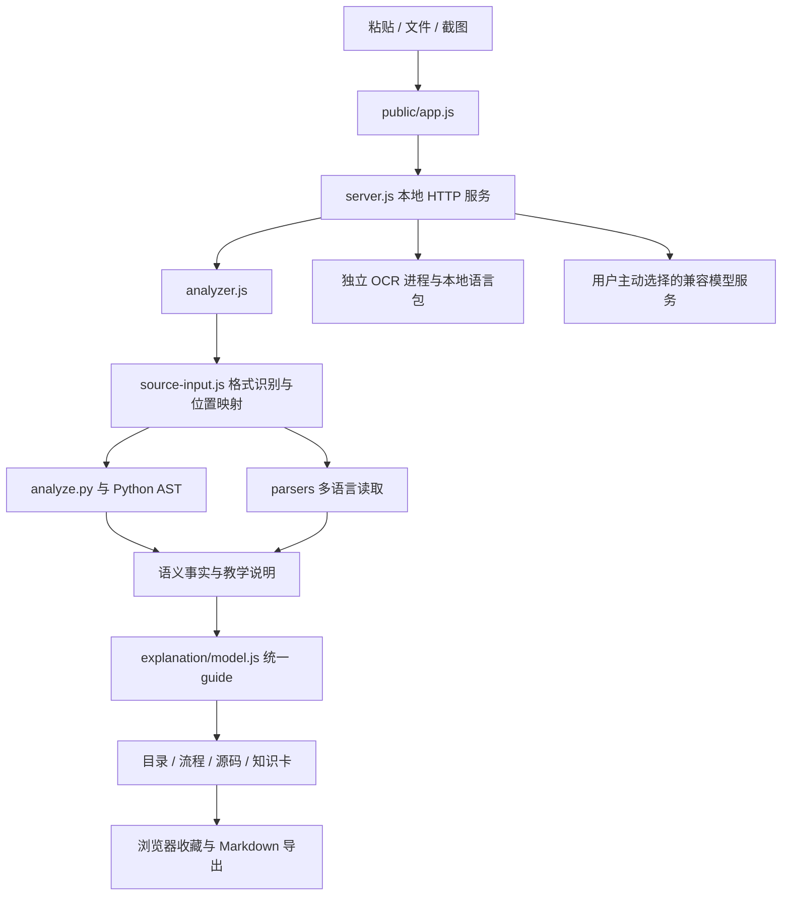

> 历史记录：其中的反馈输入已在公开迁移时替换为自编回归样本，旧文字和数字不代表对原始反馈文件的新验收。迁移范围见 [迁移说明](PUBLIC_MIGRATION.md)。

# 项目分析与协作接入记录

审读日期：2026-09-14。基线提交：`a91828410c372c8f23ace3885c18628842995db4`，
应用版本：0.7.7。以下结论依据该提交的仓库文件、当前运行结果及只读 GitHub 查询。
本次配置工作不修改产品解析规则或界面行为。

## 1. 总体判断

这是面向初学者的本地代码阅读应用，核心价值是把源码位置、结构、有限语义解释、
流程和教学卡关联起来。它已有较完整的回归材料，可以继续分模块协作开发。
当前仍是早期预览版：主要分析单文件，复杂动态行为和外部库实现保留缺口；
不应按通用项目理解引擎或成熟桌面发行版来安排交付。

接入时主要障碍来自开发环境与协作基础设施：Windows 换行转换破坏样本校验、
Python 选择方式不统一、没有 PR 自动检查。修正本机环境后，193 项现有测试和
19 个公开样本通过；现有浏览器验收另有失败，见第 5 节。

## 2. 全仓范围与阅读方式

基线共 196 个跟踪文件：193 个文本文件、3 个二进制资源。按换行分隔计数约
21,187 行，包含源码、文档、锁文件、样本及许可证，不能视为产品代码行数。
其中有 75 个应用/桌面实现文件、22 个 `*.test.js`、15 个浏览器脚本。
二进制资源为一张文档截图和两个 OCR 语言模型。

本次对全仓文件读取并建立字节数、SHA-256、文本行数与依赖引用清单；重点审读
服务端、分析入口、Python 解释链、各语言解析入口、共享数据模型、浏览器交互、
OCR、桌面构建与测试入口。第三方样本按测试数据处理，不作为项目模块执行。
这属于全仓结构分析与核心实现审查，不表示每个分支的语义或所有外部环境均已验证。

## 3. 实际架构

| 层 | 主要文件 | 实际职责与修改边界 |
| --- | --- | --- |
| 服务 | `server.js` | Node 原生 HTTP 服务；静态文件、分析、追问、OCR、桌面收件和退出接口 |
| 输入与调度 | `source-input.js`、`prepare.js`、`analyzer.js` | 类型判断、有限格式恢复、解析器路由、块数量限制和输入指纹 |
| Python 结构 | `analyze.py`、`flow_python.py`、`spans_python.py`、`recover_python.py` | AST、控制流、UTF-8 字节列到 UTF-16 列转换、局部恢复 |
| Python 解释 | `beginner.py`、`python_explain.py`、`semantics_python.py` | 名称来源、语句说明、JSON/字符串/重试等有限语义 |
| Python 教学 | `pedagogy_python.py`、`python_foundations.py`、`call_reading_python.py`、`learning_python.py` | 通俗说明、参数/调用/元组讲解、知识点位置、文件框架 |
| 多语言 | `parsers/` | JS/TS 使用 TypeScript；Java 使用 java-parser；Shell 使用 Tree-sitter Bash；其他格式分别读取 |
| 统一模型 | `explanation/model.js` 及各 guide 模块 | 组织用途、依据、输入输出、引用位置、已知缺口 |
| 前端 | `public/app.js`、`structure-ui.js`、`guide-ui.js` | 原生 DOM 交互；目录、流程、展开阅读与定位，没有 React/Vue 构建链 |
| 共享展示 | `public/code-view.js`、`reading-model.js`、`reading-ui.js` | 源码行号、缩进、保守着色和符号说明，不替代正式语法解析 |
| 知识与持久化 | `public/knowledge*.js`、`public/knowledge/` | 内置教学卡、按源码范围匹配、浏览器 localStorage 收藏和导出 |
| OCR | `local-ocr.js`、`ocr-worker.js`、`ocr-layout.js`、`ocr-consensus.js` | 子进程识别、双次结果比较、几何缩进估算和语法复查 |
| Windows | `launch.ps1`、`capture.ps1`、`widget.ps1`、`desktop/` | 启动、截图、悬浮窗、C# 托盘包装和 NSIS 安装器 |

最重要的跨模块约定是源码坐标与 guide：行号从 1 开始、列号按 UTF-16 从 0 开始，
结束列不包含在范围内。修改位置计算需要同时考虑中文、emoji、CRLF、复制围栏、
选区偏移和恢复片段，否则会出现“说明正确但跳转错误”。

## 4. 能力与工程质量

**已经具备的基础：**

- 依赖版本及 pnpm 版本已锁定；安装脚本默认禁用，适合可复现安装。
- 本地分析主要通过 AST/语法树读取，不需要用户的第三方 Python 包。
- 正反例测试涵盖标准库名称覆盖、复制恢复、源文位置、知识卡及部分 API 行为。
- 内置 137 张知识卡；它们是已编写的教学主题，不是语言或业务理解覆盖率。
- 公开样本包含来源、固定版本、哈希与许可证；发行验证会核对原始字节。
- API 监听 `127.0.0.1`，检查 Host 与每次启动生成的 token；静态资源采用路由白名单，
  页面设置 CSP。AI 密钥不随页面配置写入 localStorage；选择 AI 后才调用配置服务。
- OCR 模型随源码保存，识别由受超时限制的独立进程完成。

**当前限制：**

- Python/JS/Java 的语法读取与业务理解深度不同；识别扩展名不等于支持可靠解释。
- 没有完整跨文件调用图、框架语义、动态覆盖分析或项目依赖运行验证。
- Node 服务同步调用部分解析器。Python、Java、Shell 的 `spawnSync` 及同进程 JS
  分析会占用主线程；以后支持更大文件或并发分析时应评估异步队列/worker。
- 前端通过多个全局函数和共享状态协作，脚本加载顺序重要；大量单行实现增加审查
  与合并难度。多人同时改 `public/app.js`、`structure-ui.js` 容易冲突。
- `guide` 没有统一的静态类型或完整运行时 schema；新增字段要核对所有消费位置。
- 收藏按浏览器与本地地址保存，不是账户同步；更换端口/浏览器会影响可见收藏。
- AI 返回数据只做部分结构和行范围核对，没有完整字段类型校验；后续应补 malformed
  字段反例。该项来自代码审查，本次未进行外部模型服务兼容性测试。

## 5. 本次实际验证

环境：Windows，Node.js 24.14.0，Python 3.12.11，pnpm 10.15.1。
复查浏览器使用 Edge 与项目忽略目录内的 Playwright 1.63.0。
恢复原始字节后的应用构建号为 `56d8c08ef304003f`。

| 检查 | 实际结果 | 说明 |
| --- | --- | --- |
| 按锁文件安装 | 通过 | 36 个项目依赖包；未更新 package.json 或 pnpm-lock.yaml |
| 刚 clone 后的自动测试 | 179 通过 / 14 失败 | 样本换行被转换；部分测试写死 `python`，未找到所需解释器 |
| 刚 clone 后的公开样本 | 0 / 19 通过 | 19 个工作树哈希均不符；逐个核对 Git HEAD 后确认原提交哈希正确 |
| 修正环境后的自动测试 | 193 / 193 通过 | 无跳过；不修改业务源码或测试断言 |
| 修正环境后的公开样本 | 19 / 19 通过 | 保留原 manifest 哈希 |
| `dev.ps1 -Task Verify` | 通过 | 使用新入口再次执行上述两组检查 |
| Windows 换行回归检查 | 54 / 54 文件字节一致 | 在临时仓库设 `core.autocrlf=true`，加载新属性文件并重新检出所有测试材料 |
| 配置检查 | 通过 | PowerShell 语法解析；CI YAML 解析、只读权限与固定 Action 引用检查 |
| OCR 语言模型完整性 | 通过 | 两个模型的字节数和 SHA-256 均匹配 manifest；不代表识别效果已验收 |
| HTTP `/health` | 通过 | 服务返回应用版本和构建号；测试服务结束后已停止 |
| `tests/browser-semantics.cjs` | 失败 | 首个 Python 输入分析成功，之后点击不可见知识卡超时，未完成后续收藏/窄屏检查 |

浏览器失败发生于
`#nodeStudy .knowledge-card[data-concept="py.json-read"]>summary`。
`public/knowledge-ui.js` 会把第 4 个及之后的知识卡放进默认折叠的
`.knowledge-more`；测试在首次点击这张卡之前没有展开该父层，存在脚本与页面结构
不同步的证据。应单独修复测试的实际用户展开步骤并复查页面，不能把本轮记作浏览器全通过。

本次未运行：五个外部仓库的 125 文件专项检查、其余浏览器脚本、真实截图 OCR 效果、
Windows 多屏截图/悬浮窗、桌面安装卸载、Python 3.8/Node 20 兼容性矩阵。
新增 GitHub Actions 尚未推送运行，Ubuntu 结果仍待远端 CI 验证。

原始日志保存在忽略目录 `.runtime/`，浏览器报告位于
`.browser-artifacts/semantics/browser-result.json`；这些本机产物不进入 PR。

## 6. 协作现状与本次配置

基线仓库是私有仓库，默认分支为 `main`；当前协作者有 WRITE 权限，适用已有的
“同仓库任务分支 → PR → 所有者审查合并”流程，不需要另建 fork。
查询时 `main.protected=false`；规则接口返回套餐限制信息，因此不能声称远端已强制保护。

本次新增/更新：

| 文件或位置 | 作用 |
| --- | --- |
| `.gitattributes` | 跨平台保留 corpus、holdout、fixtures 的原始字节；标记二进制资源 |
| `dev.ps1` | Windows 的 Install / Start / Test / Verify；锁定本地 pnpm 并统一 Python 环境 |
| `AGENTS.md` | 项目级架构、源码范围、样本与验证约定 |
| `.github/workflows/ci.yml` | PR、main push 和手动触发；Windows/Ubuntu 自动测试与公开样本校验 |
| `CONTRIBUTING.md` | 补充开发入口、换行修复、Git 设置、PR 提交流程和验证边界 |
| 本地 `.git/config` | 仅快进 pull、清理失效远端引用、同名分支 push、默认 origin、关闭自动换行转换 |
| 本地 `.runtime/dev-config.json` | 本机 Python 路径；不提交个人路径 |

CI 使用官方 Action 的固定提交，配置参数参考其官方说明：
[checkout](https://github.com/actions/checkout)、
[setup-node](https://github.com/actions/setup-node)、
[setup-python](https://github.com/actions/setup-python)、
[pnpm/action-setup](https://github.com/pnpm/action-setup)。
工作流令牌只有 contents read；本地配置不会替代 GitHub 的分支保护。

## 7. 后续 PR 划分建议

1. **本次协作接入 PR**：仅包含开发入口、测试材料属性、CI 和协作说明。目标是让
   新协作者 clone 后能重复跑通基线，而不是扩大产品能力。
2. **浏览器验收修复 PR**：修正折叠区展开步骤；统一历史脚本不同的默认端口；
   浏览器测试环境固定后再增加对应 CI 任务。
3. **解释器选择统一 PR**：历史测试统一读取同一配置，减少直接写死 `python` 的调用；
   `launch.ps1` 应尊重用户已设置的 `CODELINGO_PYTHON`，并按项目约定处理端口。
4. **语义规则整理 PR**：`explanation/shell-purpose.js` 仍匹配
   `GOOGLE_MAPS_API_KEY_ENV`、`parsed_client_id` 等具体名称；应明确这是特殊配置说明，
   或提取通用结构并补重命名反例，避免扩大到任意脚本的能力声明。
5. **文档/发行一致性 PR**：README 为 0.7.7，架构和验收主标题仍分别停留在
   0.6/0.7.0；desktop 包装仍为 0.7.3.1，构建脚本还依赖仓库外的目录与材料。
   应分开记录“当前源码版本”和“已验证安装包版本”。

多人开发可按“解析/语义”“前端呈现”“测试/文档”分工，但新增 guide 字段需要共同
确认契约。每条任务分支保持一个明确问题，提交前查看 diff，避免把格式化、样本改写、
依赖升级和功能改动放在同一个 PR 中。主分支应始终保留可运行的测试基线。
